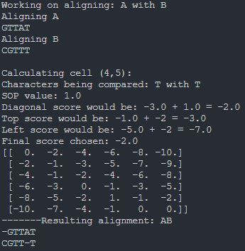
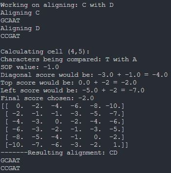
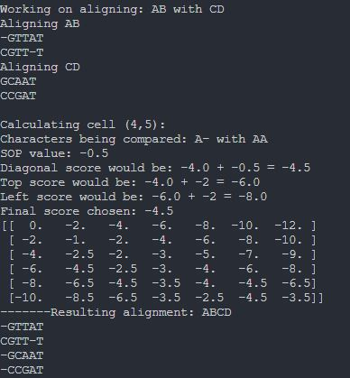

# Multiple Sequence Alignment
Originally created for BioInformatics at the University of Manitoba, but had a significant bug which caused an infinite loop when tracing back through AB CD alignment. 
Bug fixes include:
- Updating scores in all conditional branches so progress through the table happens in all branches
- Adding a termination check for reaching the end of the table
- Creating an optimal alignment array to track the optimal alignments
- Converting a `while True` loop to a `while row>=0 and col>=0` loop
- Ensuring that `fillTable` and `traceback` use scores in the same way

### ClustalW Algorithm
Builds a dynamic programming table based on 2 given sequences and fills it based on the calculated sum of pairs scores.
Optimal alignments are identified by tracing back through the table.

### ClustalW Implementation
Takes 2 sequences and processes each alignment, tracks progress, reports intermediate and final results. 
The process is as follows:
- Build the dynamic programming table based on sequence lengths and initialize the first row and column
- Fill the table by calculating the maximum score for each cell using normalized sum of pairs
- Track alignments by tracing back through the dynamic programming table and updating a global dictionary of alignments
- Traceback only returns 1 optimal alignment

### Results
##### Aligning A with B

##### Aligning C with D

##### Aligning AB with CD

