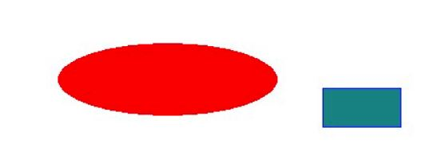
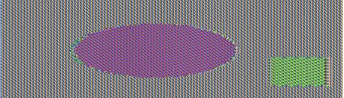

# Computer Security

A collection of labs and lab reports created during Computer Security at the University of Manitoba

##  Lab 1 - Encryption and Decryption

### CBC vs ECB Encryption
Given the original image, I compared the security of CBC and ECB encryption.

Using the command line and the same key (123456789) to encrypt the image, I obtained the following encrypted images:

In the image encrypted with CBC, there are no clear patterns to see, only noise. 

In the image encrypted with ECB, there are clear patterns that show the shapes and similar colors to the original image. Typically, images are not suitable for ECB encryption because patterns are repeated with ECB encryption.

Compared to CBC, ECB encryption is less secure because clear patterns are visible.

### RSA
I defined p, q, and e as specified in the lab and used BIGNUMs.
RSA encryption uses the following formula:
- `n = p*q`
- calculate `phin = (p-1)*(q-1) using the BIGNUM function `BN_mul (n, p, q, context)`
- Since 1 is not a BIGNUM, the above calculation needed to be done using `p = hex of p -1` and `q = hex of q -1`
- Calculate the private key `d` by computing a unique `d` such that `ed = 1 mod phin` using the BIGNUM method `BN_mod_inverse(d, e, phin, context)` since `d` is the multiplicative inverse of `e % phin`

Using RSA encryption, I determined d to be `3587A24598E5F2A21DB007D89D18CC50ABA5075BA19A33890FE7C28A9B496AEB`.

To verify the encryption, I used the following:
- private key d as determined above
- the plaintext to encrypt & decrypt is "A top secret!" (converted to hex)
- The plaintext is encrypted using the public key `(e,n)`  and `res = plaintext ^ e mod n`
- The encrypted text is decrypted using the private key `d` and `res = ciphertext ^ d mod n`
- The decrypted text is given in hex and when converted to ASCII, it is "A top secret!"

## Lab 2 - Buffer Overflow Exploit & Address Randomization
This lab compares the exploitability of a buffer overflow attack and the effectiveness of address randomization. 

### Buffer Overflow

When address randomization is off, I can use `gbd` to create an empty bad file, create a breakpoint at `bof`, and run the provided shellcode. Using the breakpoint, I can determine the pointer to the current stack frame and the buffer. Using the space between the buffer and the stack frame, I can determine the location of the return address.

I edited the provided python script to change the return address to perform a buffer overflow exploit, which will give me root access. Using the terminal, I can compile the script and make it executable. I then run the exploit and get root access.

### Buffer Overflow & Address Randomization

With address randomization on, it took just over 12 minutes for the buffer overflow exploit to work.

## Lab 3 - Environment Variable Manipulation
This lab is a demonstration of environmeent variable manipulation, creation, and passing environement variables between processes.

### Passing Environment Variables
In this experiment, I passed environment variables between a parent and child process and then between the child back to the parent. I then piped the output of both attempts to separate files and compared the results using `diff`. Since `diff` detects no difference between the two files, the environement variables of both processes are the same, indicating that the environment variables were passed successfully.

### SUID Programs
To change a program into a SUID program, I used the following commands:
- To change ownership to root: `sudo chown root a.out`
- To make `a.out` a SUID program: `sudo chmod 4755 a.out`
After ensuring that I wasnt in a root account, I set the environment variables `PATH`, `LD_LIBRARY_PATH` and a newly created variable `TEST` as specified in the lab.

Using `./a.out | grep LD_LIBRARY_PATH`, I can see that the environment variable is NOT transfered to the SUID program, but TEST and PATH are.

### Trojans
Using the provided code, `suid.c`, I compiled it into an object tile (`goodls`), set its root ownership, and made it a SUID program.
Running `goodls` searches the correct path and runs `ls`.

To get `suid.c` to run a trojan, I created another file (`badls`) and compiled it into `ls`.  I changed the PATH environement variable so that the home directory will be searched before the PATH variable. Since `badls` was compiled into `ls` and it has the same name as the relative path in `goodls`, it was run before `goodls` and the trojan was executed.

## Lab 4 -  SQL Injection
This lab is a demonstration of SQL injection using a webpage form and the command line to view and change database information. 
SQL injection commands include:
- Injection via `SELECT`  directly on a web page
- Injection via `SELECT` using `curl` on the command line
- Injection via appending a new SQL statement on a web page
- Injection via `UPDATE` on a web page

## Lab 5 -  SYN-Flooding & SYN-Cookie Countermeasure
This lab uses Docker containers to simulate a SYN-Flooding attack on a victim server.

### SYN-Flooding
On the victim container, I turned off the cookie counter measure by setting the `SYN_COOKIE` environment variable to `0`. Then I launched the SYN-Flooding attack from the attacker container on the victim container.
When checking the victim container using `netstat`, I can see that the queue of connections is full, and after flushing all past records of connection, I can attempt to `telnet` onto the victim container. Attempting to `telnet` results in a timeout, indicating that the SYN-Flooding attack was successful.

### SYN-Cookie Countermeasure
The syncookie countermeasure essentially causes connections to not be held in the queue. Instead, the victim container passes a cookie with its SYN+ACK and drops the connection from its queue. Then if the victim gets an ACK response 
with a cookie, it recalculates the cookie using known connection information. If the newly calculated cookie matches the 
cookie the victim recieved with the response, the connection is ESTABLISHED. With this countermeasure in place, the 
queue doesn't need to store previous connection records, since connections rely on calculating and matching cookies.

To turn the countermeasure back on, I set the `SYN_COOKIE` environment variable to `1` on the victim container. Then I ran the SYN-Flooding attack again and checked the SYN_RECV connections queue on the victim container. On my host VM, I can successfully `telnet` to the victim container, showing that the SYN-Cookie countermeasure was effective.
